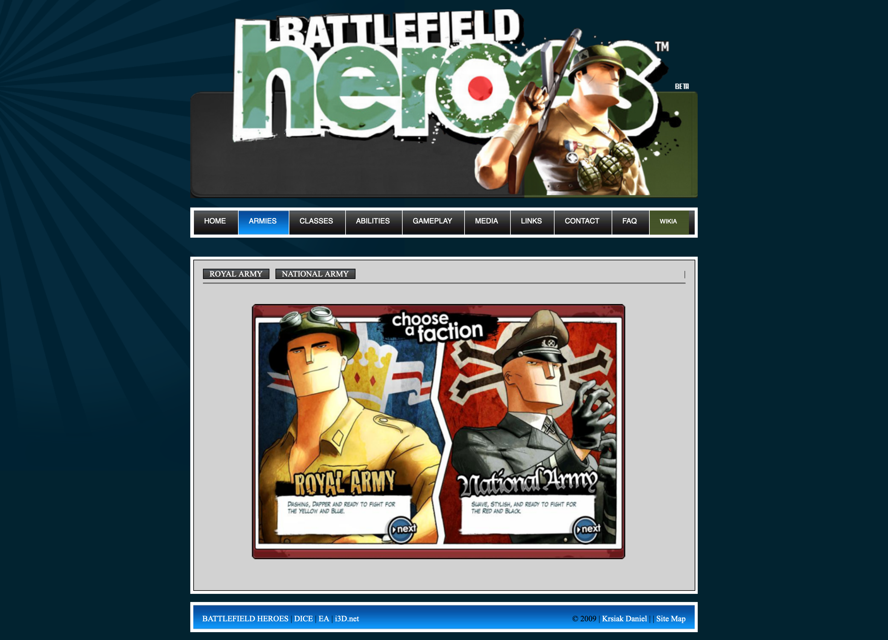
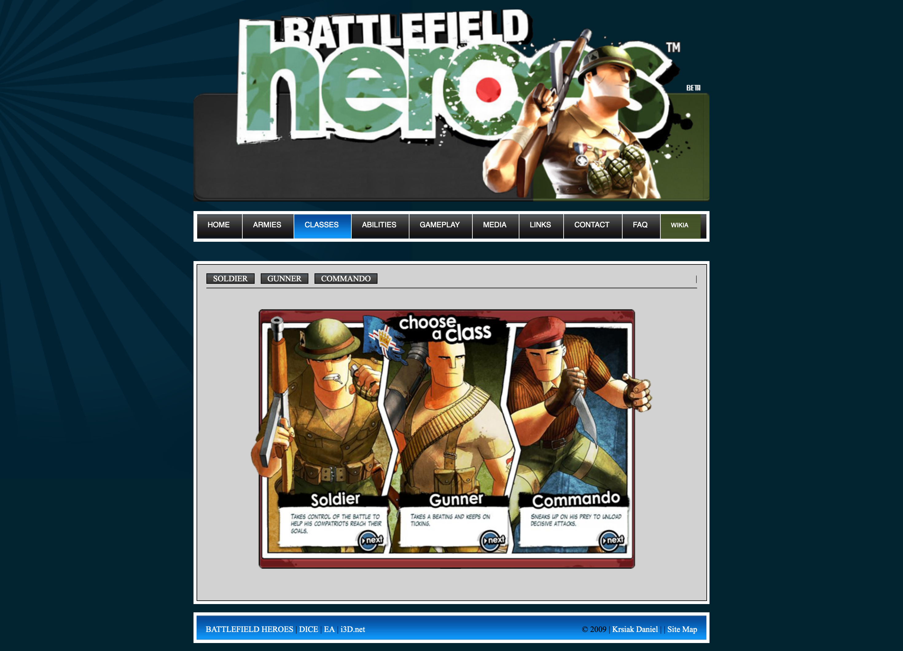
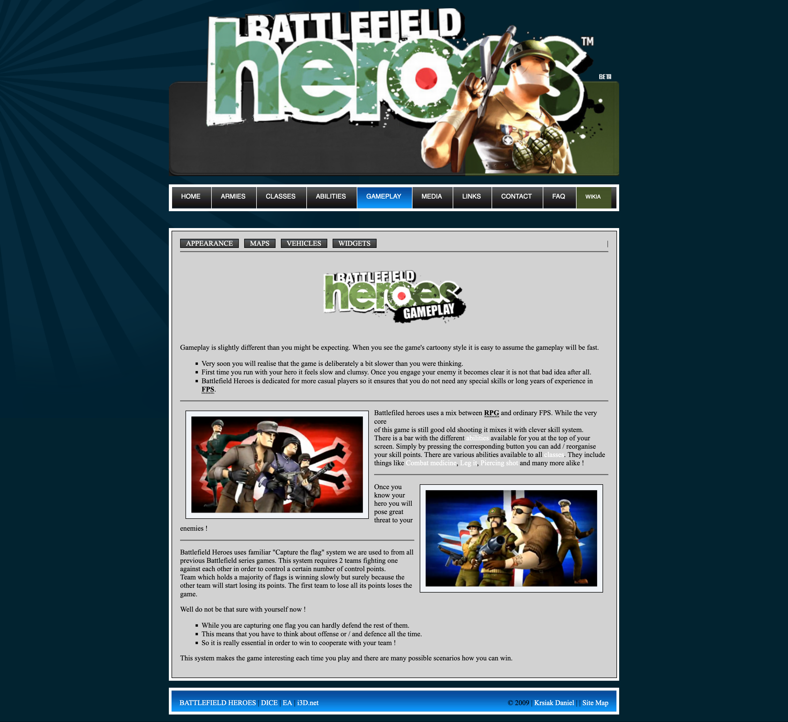

# Battlefield Heroes - Website in PHP

This was 1 month challenge back in 2009 to learn the basics:

- **HTML**
- **PHP**
- **JavaScript**
- **Adobe Photoshop**

The website landed me my first IT job 🙂

## Localhost

- Install PHP on your local machine `brew install php`
- Type `make start` to run the website.
- Or run this command directly: `php -S localhost:8000`

## Screenshots

Here you can see what the website looks like.

